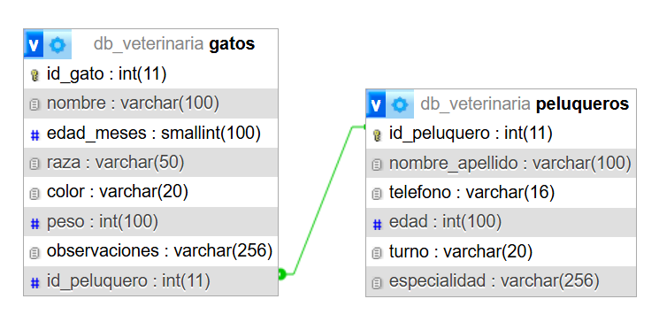
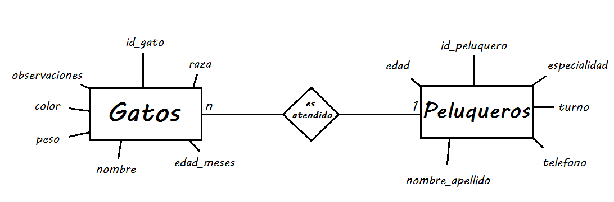

[12-11]

[LINK DE LA VERSION API REST (PARTE 3)](https://github.com/RodriM-2/TPE-WEB2-TUDAI-PT3)

[04-11]

Corregidos los View, agregadas las template y modificado tambien el deploy en base a las correcciones mencionadas.

[ATENCION !!]

Para realizar la mayoria de acciones (editar, borrar y agregar) van a tener que logear:

Usuario: UserEjemplo

Contraseña: SuperLun@22

O sino tambien pueden usar el del enunciado TPE (User: webadmin / pass: admin)

Integrantes:
Rodrigo Joaquin Membrilla - rodrigomembrilla5@gmail.com

Tematica de TPE:
Peluqueria y centro de atencion para gatos

Descripcion:
Centro de atencion ficticio para gatos con peluqueros y otros servicios incluidos
(De momento solo peluqueria)

